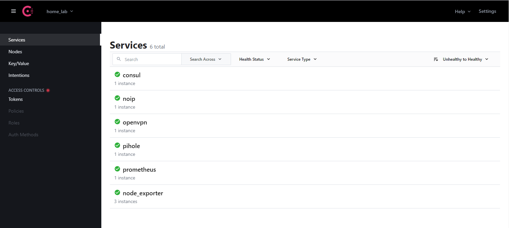
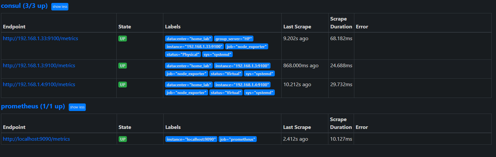

# Home Lab

## My Home Lab config :
My main hypervisor is proxmox , I have 2 major VM all of them install consul-client and node-exporter to get service discovery & monitoring use prometheus & consul
this action because logging in proxmox for VM is not very detail

Read more about Home Lab on virgool(persion): https://vrgl.ir/J46uS  
Read more about Monitoring on virgool(persion): https://vrgl.ir/W2egj  
Read more about Monitoring on medium(english): https://medium.com/@mr.salehi/prometheus-consul-3f3df009efaf

<b>Consul Server</b>

  
At its show I have 2 VM (rancher & ubentu) and pve is the proxmox server
  

  
I have a lot of services and it increases 

<b>Prometheus Server</b>

  
all the node-exporter is up and working
